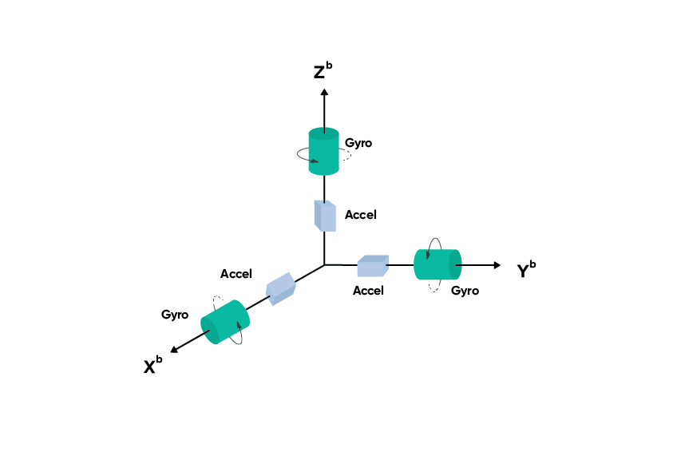

IMU sensors are widely used in robotics, wearables, smartphones, drones, and many embedded systems to measure motion and orientation. IMU stands for **Inertial Measurement Unit**, and it typically combines multiple sensors such as an accelerometer and a gyroscope, and sometimes a magnetometer.

In this post, I will cover the basic idea of IMU sensors, what kind of data they produce, and how that data can be collected and processed for practical use.

## What is an IMU sensor

::: {.columns}

::: {.column width="55%"}

An IMU is a sensor module that measures the motion of an object in space. Depending on the sensor, it may provide:

- acceleration along the x, y, and z axes  
- angular velocity around the x, y, and z axes  
- magnetic field values along the x, y, and z axes  

Based on the number of sensing components, IMUs are often described as:

- **6-axis IMU**(IMU-6050): accelerometer + gyroscope  
- **9-axis IMU**(IMU-9250): accelerometer + gyroscope + magnetometer  

These measurements help estimate movement, tilt, rotation, and orientation.

:::

::: {.column width="45%"}



*Typical IMU coordinate frame showing accelerometer and gyroscope axes.*

:::

:::

## Main components of an IMU

### Accelerometer

The accelerometer measures linear acceleration along three axes. It detects both motion based acceleration and gravity. Because of this, it can also be used to estimate tilt when the sensor is stationary.

Example outputs:

- acceleration in x direction
- acceleration in y direction
- acceleration in z direction

### Gyroscope

The gyroscope measures angular velocity, which tells how fast the sensor is rotating around each axis.

Example outputs:

- rotation around x axis
- rotation around y axis
- rotation around z axis

Gyroscope data is useful for tracking rotation, but over time it tends to drift if used alone.

### Magnetometer

A magnetometer measures the surrounding magnetic field. It is commonly used as a digital compass to estimate heading relative to Earth’s magnetic field.

However, magnetometer readings are often noisy and can be affected by nearby metal objects or electronics.

## What kind of data does an IMU generate

An IMU usually outputs time series data. At each timestamp, it provides values like:

- `ax, ay, az` for acceleration
- `gx, gy, gz` for angular velocity
- `mx, my, mz` for magnetic field, if available

A sample data row may look like:

```text
timestamp, ax, ay, az, gx, gy, gz
0.01, 0.12, -0.03, 9.78, 0.01, 0.02, -0.01
```

## Setup Configuration

To connect the **MPU6050 IMU sensor with Raspberry Pi 3**, communication is done using the **I2C interface**.

### Wiring

| MPU6050 Pin | Raspberry Pi 3 Pin | GPIO Function |
|-------------|-------------------|---------------|
| VCC | Pin 1 | 3.3V |
| GND | Pin 6 | GND |
| SDA | Pin 3 | GPIO2 / SDA |
| SCL | Pin 5 | GPIO3 / SCL |

### Optional Pins

| MPU6050 Pin | Usage |
|-------------|-------|
| XDA | Leave unconnected |
| XCL | Leave unconnected |
| AD0 | GND → `0x68`, 3.3V → `0x69` |
| INT | Optional interrupt pin |

### Important

Use **3.3V**, not **5V**, to avoid damaging the Raspberry Pi.

---

## Data Collection

The following Python script reads accelerometer and gyroscope data from an **MPU6050 IMU sensor** and stores the readings in a CSV file.

```python
from mpu6050 import mpu6050
import time
import csv

s = mpu6050(0x68)
filename = "imu_data.csv"

with open(filename, mode="w", newline="") as file:
    writer = csv.writer(file)
    writer.writerow([
        "timestamp",
        "accel_x", "accel_y", "accel_z",
        "gyro_x", "gyro_y", "gyro_z"
    ])

    try:
        while True:
            ac = s.get_accel_data()
            gr = s.get_gyro_data()
            ts = time.time()

            writer.writerow([
                ts,
                ac['x'], ac['y'], ac['z'],
                gr['x'], gr['y'], gr['z']
            ])
            file.flush()

            print(f"Accel: x={ac['x']:.2f}, y={ac['y']:.2f}, z={ac['z']:.2f}")
            print(f"Gyro : x={gr['x']:.2f}, y={gr['y']:.2f}, z={gr['z']:.2f}")
            print("." * 30)

            time.sleep(0.5)

    except KeyboardInterrupt:
        print("Stopped by user")
```